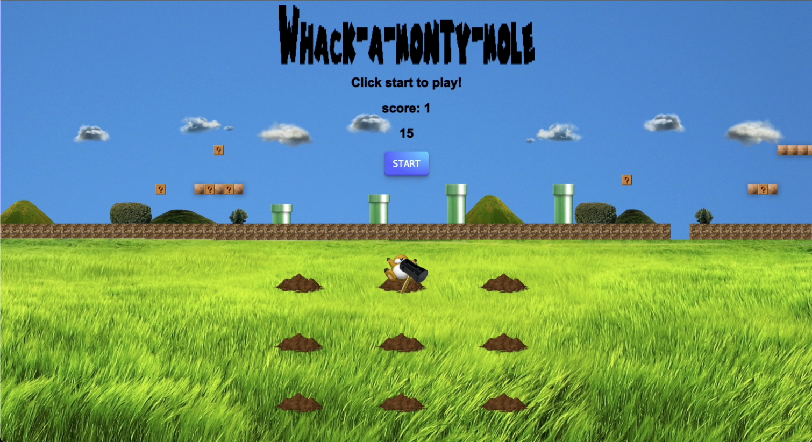

# Whack-a-Monty-Mole!

This is a simple whack-a-mole game that is super mario themed. It uses Javascript, HTML, and CSS.

As someone playing the game, the objective is to use the mario hammer to hit(click) Monty the mole, who appears at random from the holes, as quick as possible within the time limit.

## File and Stucture

1. index.js - JS file containing game logic
2. index.html - HTML file containing structure of game
3. styles.css - CSS file containing the styles and design of the game elements

# Features

- Time limit for each round
- Difficulty level
- Super Mario themed music and characters

## Setup

1. Go to the live page at: https://rlimun.github.io/js-dev-final-capstone-starter-whack-a-mole/
2. From here, just click the 'Start' button on the page and the game will start!

## Customization 

All customization would be set in the index.js.

- You can set the time limit of how long you would like to play by entering a number (in seconds) of this call: "setDuration(n)" inside the "startGame()" function.
- You can set difficulty by entering: 'easy', 'normal', or 'hard' in the variable at the top of index.js [line 13] (let difficulty = "normal";)

# How to play:

1. Click the 'Start' button 
2. Use your mouse to move the Mario hammer around and click on the mole as it appears
3. Every time you click on the mole, you get a point
4. Try to score as many points as possible within the time limit!

## Notes on the focus of this project:

This is the first capstone project I completed after my first course in Chegg Skills - Web Development. A lot of the functions described what the function needed to do in the comments, and I wrote the code to complete those functions. This project focused on how to install packages via npm, how to write HTML, CSS, and JavaScript code, how to use event listeners and event handlers, and how to deploy a basic website with GitHub. It had its own assets with pictures of the mole, background, dirt mound, etc., but I decided to make it my own using Monty Mole from Super Mario. I also added Super Mario background music while you're playing the game.

